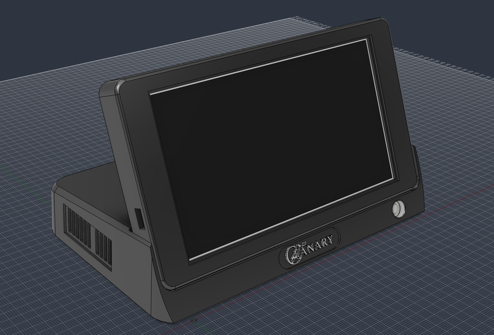

# CANARY

CANARY shows the air in a room on a 5.2" e-paper display. It measures CO₂, particulates, gas (VOC),
temperature, humidity and pressure.



It has two halves and a server:

- The **dock** holds the sensors. It takes a reading every 5 minutes, and every 30 minutes from 01:00 to 07:00,
  and sends it to the server.
- The **display** stands on the dock. Every 5 minutes it shows the next page that the server draws from the
  readings.
- The **server** runs on a computer of yours. It keeps the readings, draws the pages, and can update the firmware
  on both boards. Its config sets the times above.

One USB-C cable powers the dock and the display.

| What | Part |
|---|---|
| CO₂ | Sensirion SCD41 (Adafruit breakout) |
| Particulates: PM1.0, PM2.5, PM10 | Plantower PMSA003I (Adafruit breakout) |
| Gas (VOC) and pressure | Bosch BME688 (Soldered breakout) |
| Temperature and humidity | Sensirion SHTC3 (Soldered breakout) |
| Display | Soldered Inkplate 5 Gen2 |
| Dock controller | Unexpected Maker TinyS3 |

## Build one

**You build the firmware yourself.** The dock uses Bosch's BSEC2 library to calculate the air quality index.
BSEC2 is closed source, and Bosch's licence does not let this project give out firmware that contains it. The
build downloads BSEC2 from Bosch, and Bosch's terms then apply to you. Read them first: the
[library's LICENSE.md](https://github.com/boschsensortec/Bosch-BSEC2-Library) links to them.

You need:

- The parts in [hardware/bom.md](hardware/bom.md). They cost about €220.
- A 3D printer with a 0.4 mm and a 0.2 mm nozzle, and a soldering iron.
- A computer that is always on, with Docker, on the same network as the device.
- [PlatformIO](https://platformio.org/install) on the computer that you flash the boards from.

### 1. Run the server

On the computer that is always on:

```sh
git clone https://github.com/chrisjtwomey/canary.git
cd canary
cp server/config.example.yaml server/config.yaml
mkdir -p server/firmware
```

Set these keys in `server/config.yaml`:

| Key | Value | Why |
|---|---|---|
| `source.kind` | `store` | The pages show your readings. `mock` shows a simulated room. |
| `source.path`, `status.path`, `calibration.path`, `logs.path` | The file name in `data/`, for example `data/status.db` | The data stays when Docker recreates the container. |
| `client.firmware.enabled` | `true` | The boards take new firmware from the server. |
| `server.timezone` | Your time zone, for example `Europe/London` | The pages and the schedules use it. |
| `site.altitude_m` | Your altitude in metres | The pages show the pressure at sea level. |

Then start it:

```sh
docker compose up -d
```

- The containers run as user 1000. That user must be able to write `server/config.yaml` and `server/firmware/`.
- The second container builds the firmware for both boards. Its first build takes some minutes.
  `docker compose logs -f firmware-builder` shows it.
- `http://<server>:8080/web/` shows the pages, and `/web/config` changes the config. **The config page has no
  login: anyone on your network can change the config.**
- The images follow this repo's `main` branch. Your boards take each new version.

### 2. Flash each board once

The first flash stores your Wi-Fi and the server's address on the board. After that, each board takes its
firmware from the server.

Flash both boards before you build the device. The dock's USB-C socket carries power only. To flash the dock
later, you must open it and lift the TinyS3 off its strips.

```sh
git clone https://github.com/chrisjtwomey/canary.git   # skip this if step 1 ran on this computer
tag=$(grep -o 'epd.git@[^#]*' canary/server/requirements.txt | cut -d@ -f2)
git clone --branch "$tag" https://github.com/chrisjtwomey/epd.git
cd canary
cp src/defaults.example.cpp src/defaults.cpp
```

In `src/defaults.cpp`, set `wifiSSID`, `wifiPass`, and `serverURL` to `http://<server>:8080/breathe.png`.

Connect the Inkplate by USB, then:

```sh
pio run -e esp32 -t upload
```

Connect the TinyS3 by USB, then:

```sh
PLATFORMIO_CORE_DIR=~/.platformio-canary-dock pio run -e dock -t upload
```

- The dock builds in a PlatformIO folder of its own. Its first build takes about 6 minutes, and the folder grows
  to about 7 GB.
- `pio device monitor` shows a board's log.

### 3. Build it

[hardware/assembly.md](hardware/assembly.md) builds the device in 12 steps, with a picture for each. Set aside a
day. The last step is the first power-up.

## Documentation

| Doc | What it tells you |
|---|---|
| [hardware/](hardware/README.md) | What is in the hardware folder. |
| [hardware/bom.md](hardware/bom.md) | The parts to buy, and what else would do. |
| [hardware/assembly.md](hardware/assembly.md) | How to build the device, step by step. |
| [hardware/enclosure.md](hardware/enclosure.md) | The design of the printed parts, for changes to the model. |
| [docs/architecture.md](docs/architecture.md) | How the firmware and the server work. |
| [docs/readings.md](docs/readings.md) | The data that each board sends. |
| [CONTRIBUTING.md](CONTRIBUTING.md) | For developers: the setup, the tests, and where the other developer docs are. |
