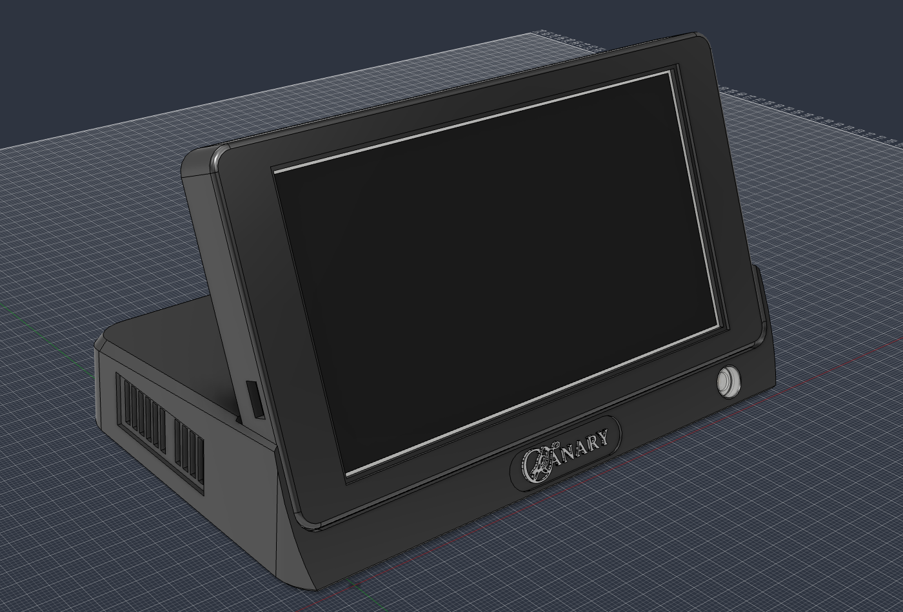

# Hardware

CANARY is two boards in one desk enclosure. The **head** is an Inkplate 5 Gen2, a 5.2" e-paper panel tilted 20°
back, which shows the pages the server renders. The **dock** is a TinyS3 carrying four sensors — CO₂,
particulates, temperature and humidity, and a gas index — that reads the room and posts it. The head stands in
the dock, and an 8-pin magnetic connector carries 5 V up to it: the only wire between the two halves.

On the desk it is 150.7 × 87.3 × 89.8 mm. One USB-C cable powers both halves.

| Where to look | |
|---|---|
| [bom.md](bom.md) | What to buy, what each part does, what else would do instead, and roughly what it costs. |
| [assembly.md](assembly.md) | How to build one, in order, with a picture at each step. |
| [enclosure.md](enclosure.md) | The printed parts: shape, fit, fasteners, ventilation, and the rules the model follows. |
| [enclosure.py](enclosure.py) | The design itself. It is a Fusion script: it places every board and builds every part from the numbers in `enclosure.md`. |

| In this folder | |
|---|---|
| `stl/`, `step/`, `3mf/` | The six printed parts, in print orientation (STEP is upright in each part's own frame). |
| `canary-logo.svg`, `canary-stencil.svg` | The logo's outlines and the stencil's, in millimetres, imported by the script. |
| `canary-logo-screen.svg` | The logo as drawn, without the changes for printing: the head's splash screen. |
| `images/` | Views of the model and the wiring drawings, used by the guides. |
| `wiring/` | The circuit as text, one file per run of wire, for [WireViz](https://github.com/wireviz/WireViz). `render.sh` draws them into `images/`. |
| `logo/` | The source picture and the script that traced it. |

The firmware and the server are in [docs/ARCHITECTURE.md](../docs/ARCHITECTURE.md), and what each board posts is
in [docs/READINGS.md](../docs/READINGS.md). Why the hardware is as it is, and what is still unsettled, are in the
decision log and the open questions in [CLAUDE.md](../CLAUDE.md).
