# Building a CANARY

CANARY is two boards in one desk enclosure: a **dock** that reads the room, and a **head** that shows it. This
guide builds both, in the order the parts go in.

## Before you start

[bom.md](bom.md) lists every part and where to buy it. Have them all on the bench, and the printed parts in
front of you, before step 1.

**Tools**

- A soldering iron with a fine tip. It also sets the heat-set inserts.
- Solder, 28 AWG stranded wire and heat-shrink.
- Wire strippers, side cutters and a small flat file.
- A crimp tool and eight 1-pin Dupont housings.
- A multimeter.
- Superglue, fine sandpaper, and screwdrivers for M2, M2.5 and M3.
- A 3D printer with a 0.4 mm and a 0.2 mm nozzle.

Every joint is soldered by hand to a header leg, a 1 mm pad or another wire. Nothing is surface-mount work. Set
aside a full day, and expect step 8 to take half of it.

**Work in this order.** Each step leaves the next one reachable. Going back means taking the dock apart, and the
TinyS3's strips are glued in. Each step draws its own wires, so the circuit comes together as you do.

1. [Print the parts](#1-print-the-parts)
2. [Set the heat-set inserts](#2-set-the-heat-set-inserts)
3. [The TinyS3 on its strips](#3-the-tinys3-on-its-strips)
4. [The USB-C socket](#4-the-usb-c-socket)
5. [The status LED](#5-the-status-led)
6. [The sensor boards](#6-the-sensor-boards)
7. [The pogo connector](#7-the-pogo-connector)
8. [Wire the dock](#8-wire-the-dock)
9. [The head](#9-the-head)
10. [Close the dock](#10-close-the-dock)
11. [The logo](#11-the-logo)
12. [First power-up](#12-first-power-up)

## 1. Print the parts

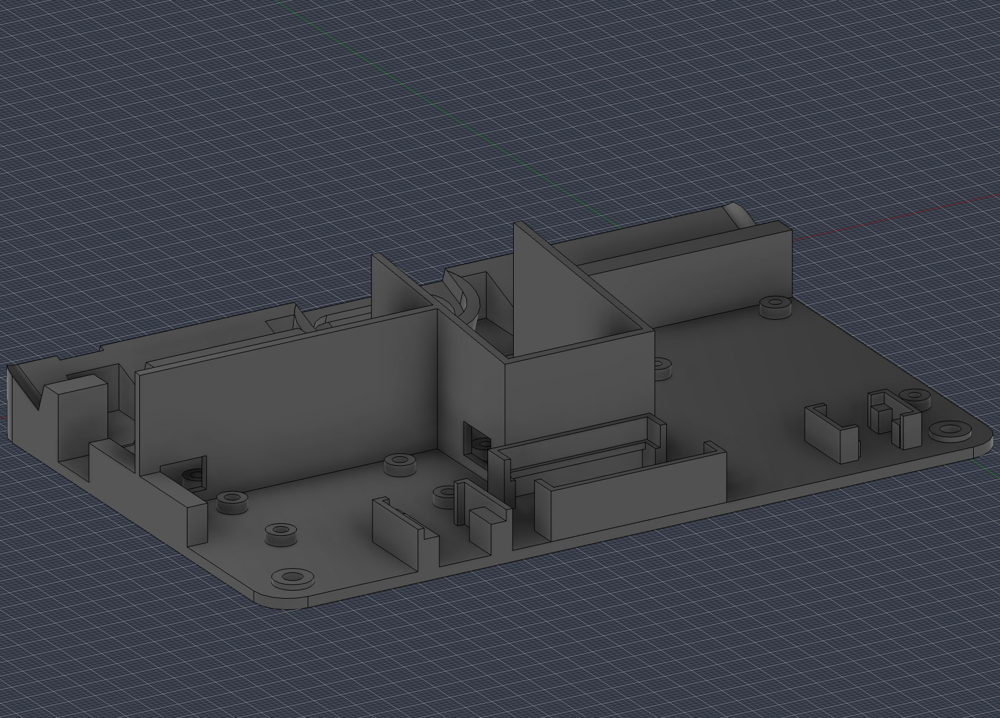
Six pieces. Each is drawn to print without supports in one orientation, and only in that one —
[enclosure.md](enclosure.md#parts) gives it.

1. Print the head tray, the head back cover, the dock chassis and the dock shell in PLA+ with a 0.4 mm nozzle.
2. Print the logo pieces and the stencil in white with a 0.2 mm nozzle, on their own plate.

## 2. Set the heat-set inserts

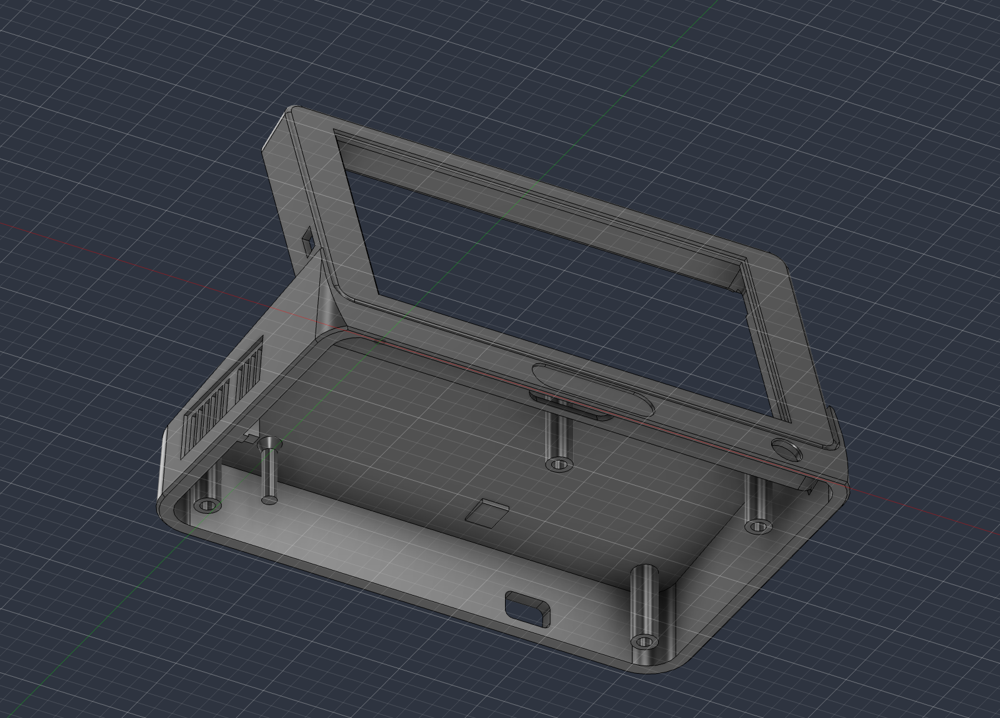
Six M3 inserts in Ø 4.0 × 6.0 mm holes: four in the dock shell's internal pillars, two in the head tray's thick
wall at the corners.

1. Push each one in square, with the iron at about 200 °C.
2. Stop when its top is flush.

**Square matters.** A crooked insert pulls its screw out of line and splits the boss.

## 3. The TinyS3 on its strips

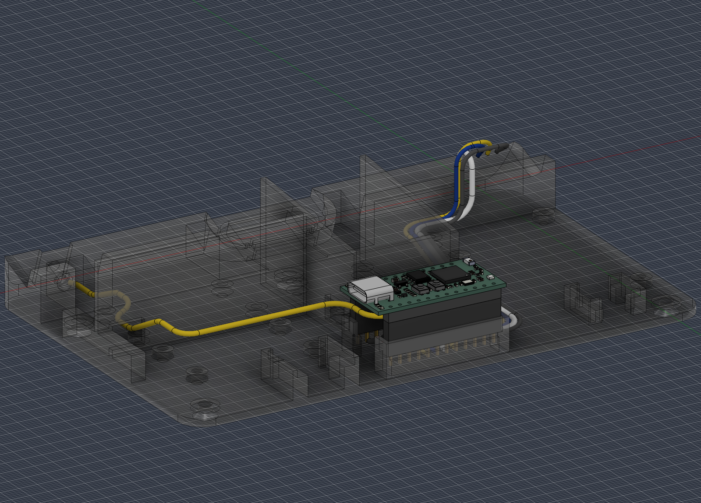

*The chassis is drawn see-through, so you can follow the wires. Everything else in the dock hangs off these seven.*

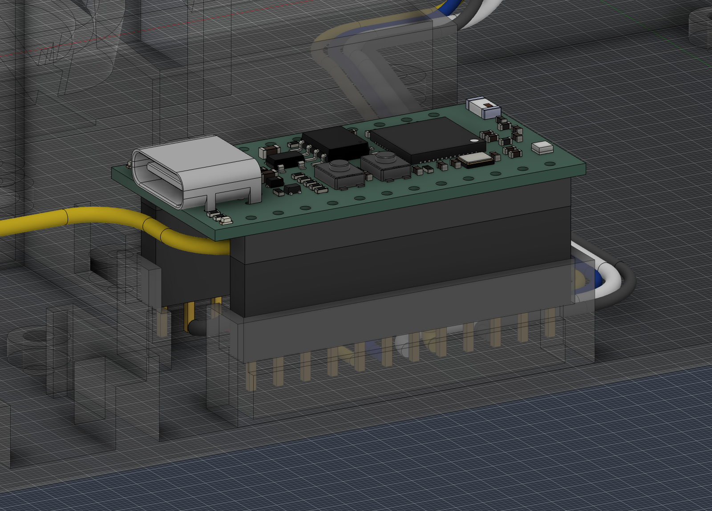

The TinyS3 plugs into two female header strips, and every dock wire is soldered to a leg of a strip. The strips
are then glued into the cradle on the chassis floor. **Solder and test every wire before any glue goes on** — to
change one afterwards, print a new chassis and wire it again.

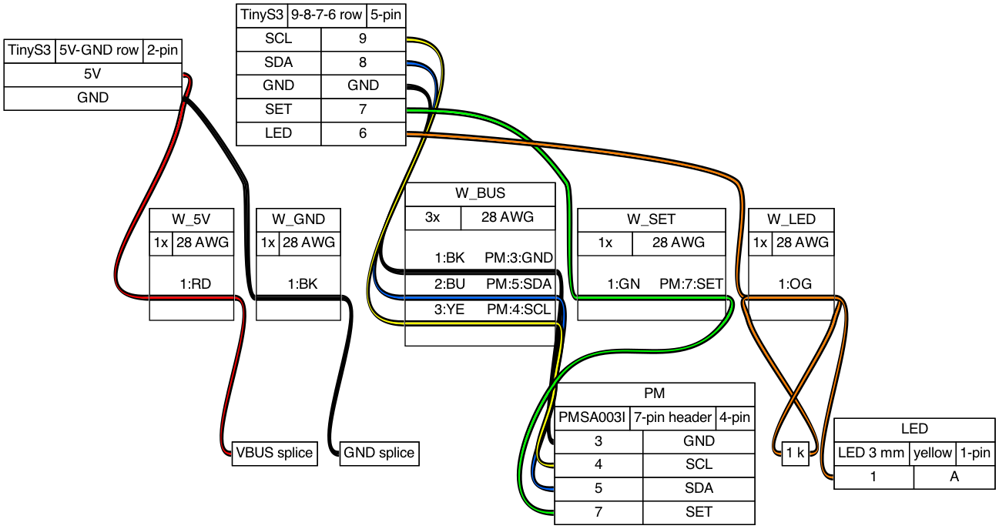

Seven wires. Two come off the row marked **BAT · GND · 5V · 3V3**, and five off the row marked **9 · 8 · 7 · 6**.
You solder the TinyS3 end now; the far ends land in steps 4 to 8.

Do all of it on the bench, away from the printed parts.

1. Cut a 12-way strip for the 9-8-7-6 row and an 11-way for the other, from standard 20-way strips. Cut through
   the next way, then file the cut end flat.
2. Push both strips fully onto the TinyS3's pins, and leave the board in them until the glue has set. The board
   is what holds the two strips parallel and the right distance apart.
3. Tin only the seven legs in the drawing, and the ends of the wires.
4. Solder each wire to the **lower half** of its leg, with the wire pointing into the channel between the strips.
5. Bend each wire along the channel, towards the end of the cradle nearer the board it feeds.
6. Look at every joint. No solder may touch the next leg, 2.54 mm away, and nothing may stand past a strip's
   outer face.
7. Meter each wire against its pin on the top of the board.
8. Dry-fit: lower board, strips and wires into the cradle, legs first. Each strip rests on its ledge and its two
   end blocks, with the joints hanging in the channel. Lead the wires out at the cradle's ends.
9. Lift it out, glue the ledges and end blocks — away from the legs — put it back and press it down.
10. Leave slack in every wire, so the board still lifts straight off the strips to be flashed.

**Leave the four end legs bare.** They clear the cradle's end blocks by 0.28 mm.

## 4. The USB-C socket

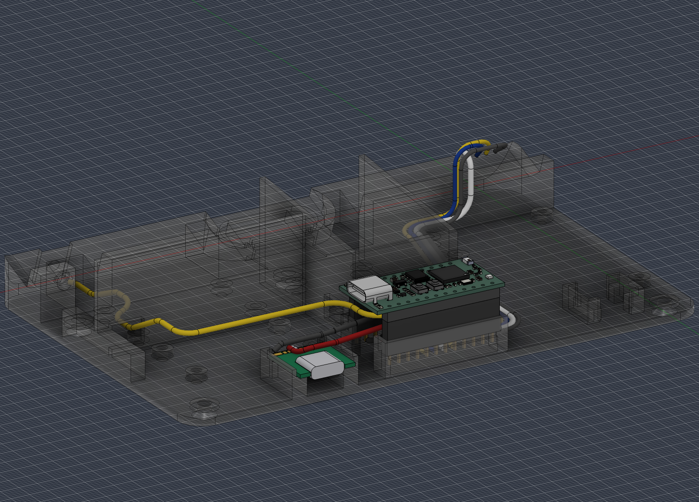

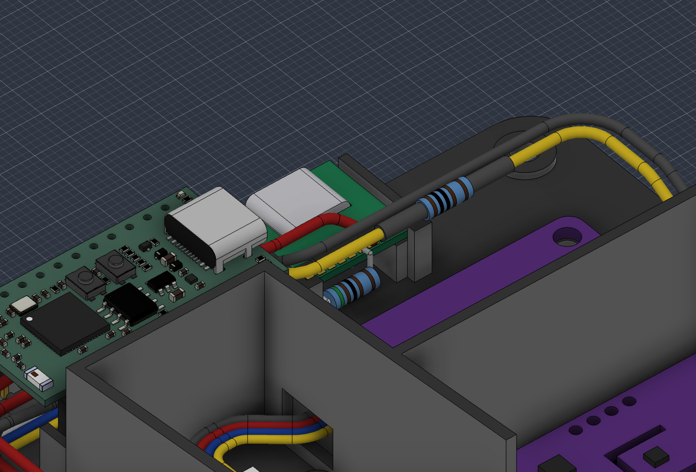

The breakout lies flat by the rear wall, its receptacle in the wall's only opening. Its two 5.1 kΩ resistors are
what make a USB-C to USB-C cable or charger supply any power at all.

1. Solder the two resistors first, on the bench. B5's lies under the board in front of the left ear's pad, its
   leads bent onto B5 and the underside's G pad. A5's hangs in front of the board's edge: one lead up round the
   edge onto A5, the other back under the board onto that same G pad, soldered with the first in one go.
2. **Meter the wide end pad on the top face before you use it as ground.** If it is not ground, take the GND
   stub to the G pad underneath instead, and cut a slot in the holder for it.
3. Solder the VBUS stub to the V pad and the GND stub to the wide end pad.
4. Lower the module into its holder, ears on their seats between the side guides and against the corner stops.
5. Glue each ear to its seat and its side guide.

## 5. The status LED

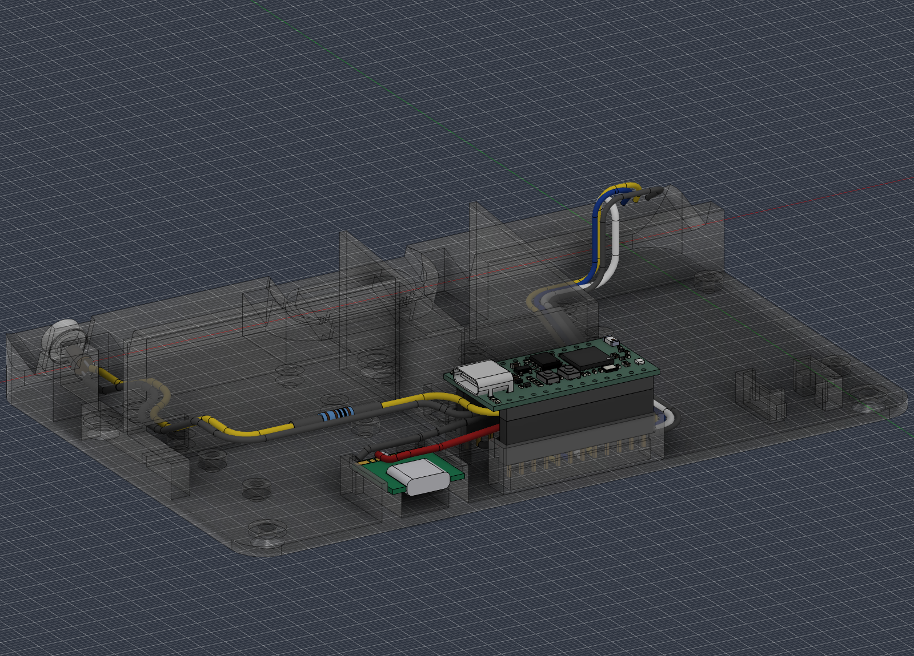

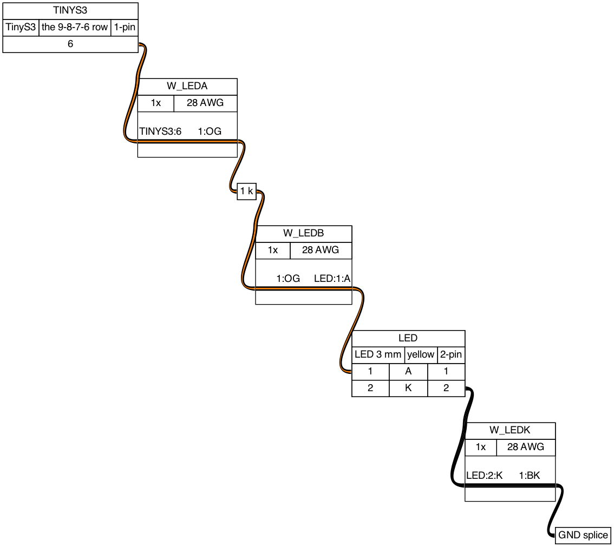

It goes in now because it is reached from a pit under the head. Once the head is on, you cannot get at it.

1. Sand the tile's front, so it glows evenly instead of showing the LED as a dot.
2. Press the tile into the shell's front face, flush.
3. Solder the LED's two wires, with the 1 kΩ resistor spliced into the anode's and heat-shrink over each joint.
4. With the head off, lower the LED into the pit, push it forward until its rim stops on the step, and glue it.
5. Run its wires back along the pit's floor into the bay.

**Reading the drawings.** Red is 5 V or 3.3 V and black is ground. Blue is SDA and yellow is SCL, which is the
Qwiic connector's own standard. Any other colour is there only to tell two wires apart — use what you have.

## 6. The sensor boards

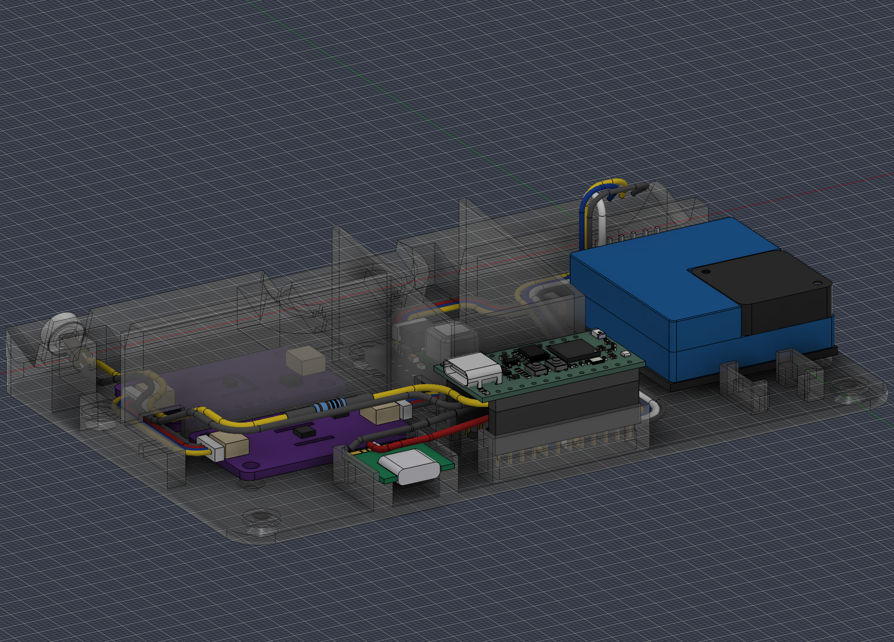

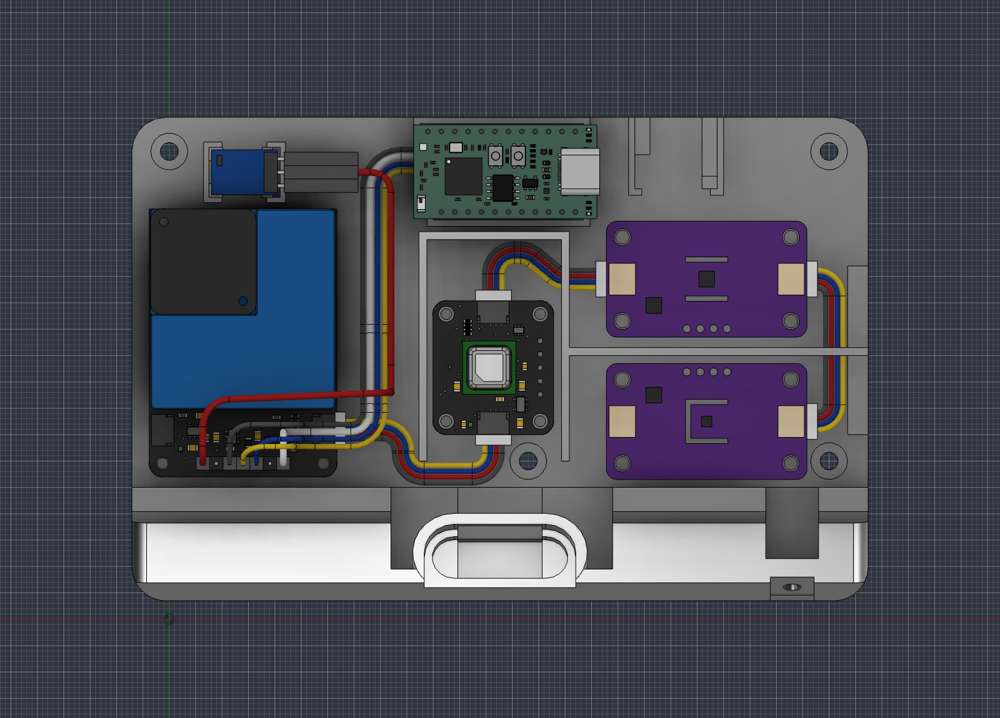

The PM board comes first in the chain: it draws the most, and the whole chain's ground returns through its
header. The SHTC3 comes last, at the open right-hand corner, farthest from the fan, the BME688's heater and the
TinyS3 — it is the temperature reference.

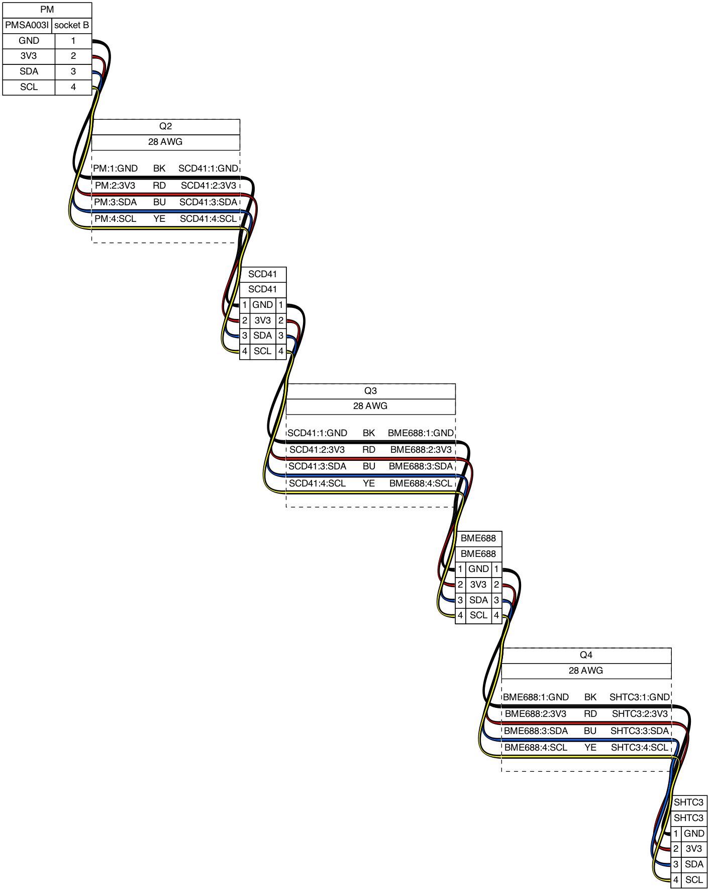

1. Screw each board to its bosses, two screws each: M2 × 4 for the PMSA003I and the SCD41, M2.5 × 4 for the
   BME688 and the SHTC3. Stop as soon as the board is held; a self-tapper that bottoms out splits its boss.
2. Join the boards with three stock Qwiic cables: **PM socket B → SCD41 → BME688 → SHTC3**. Every board has two
   sockets wired in parallel, so either one will do.
3. Use a 45 mm cable, then a 30 mm, then a 40–45 mm.
4. Lay each ribbon flat in its lane in the chassis floor. Let it bend as a ribbon does, and do not twist it.
5. Thread the last plug down the right-hand lane **inboard of the guide rib**, then let the ribbon settle against
   the rib. The shell then drops on without touching it.

**Leave the PM board's socket A empty.** It faces a wall 5 mm away, where no plug fits. The bus reaches that
board on its header instead, in [step 8](#8-wire-the-dock).

## 7. The pogo connector

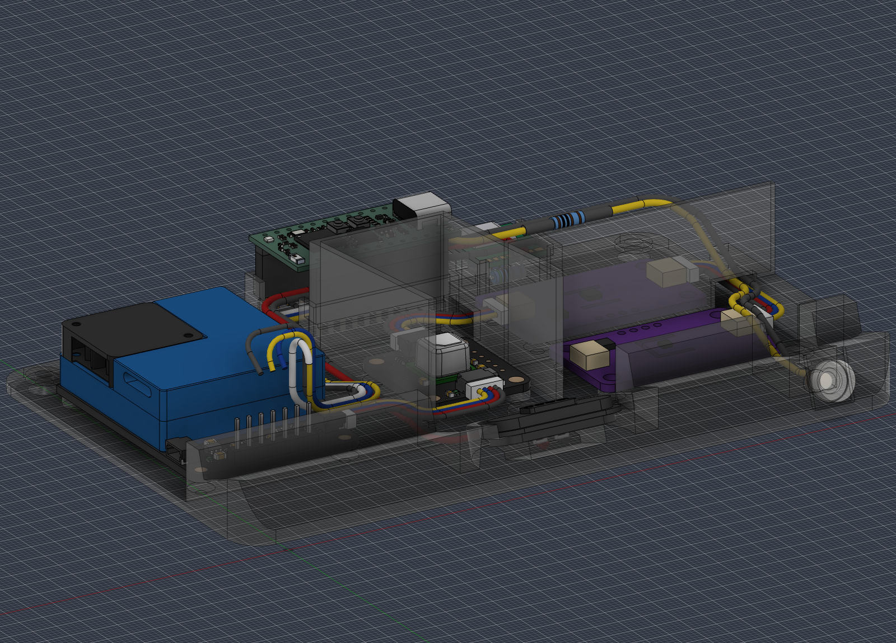

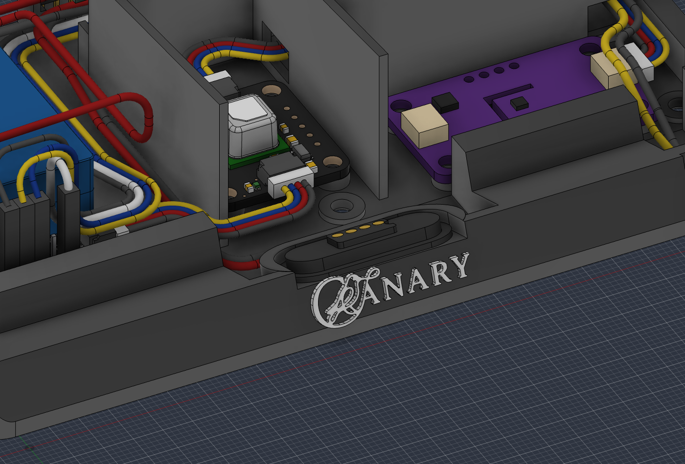

An 8-pin magnetic pair joins the head to the dock, and carries power only. The pins are 0.5 mm across
*(measured)*, so about 1 A each, and the head's power-on spike is 1.66 A. Each net therefore crosses on two
contacts joined by a bare bridge, and four contacts stay empty.

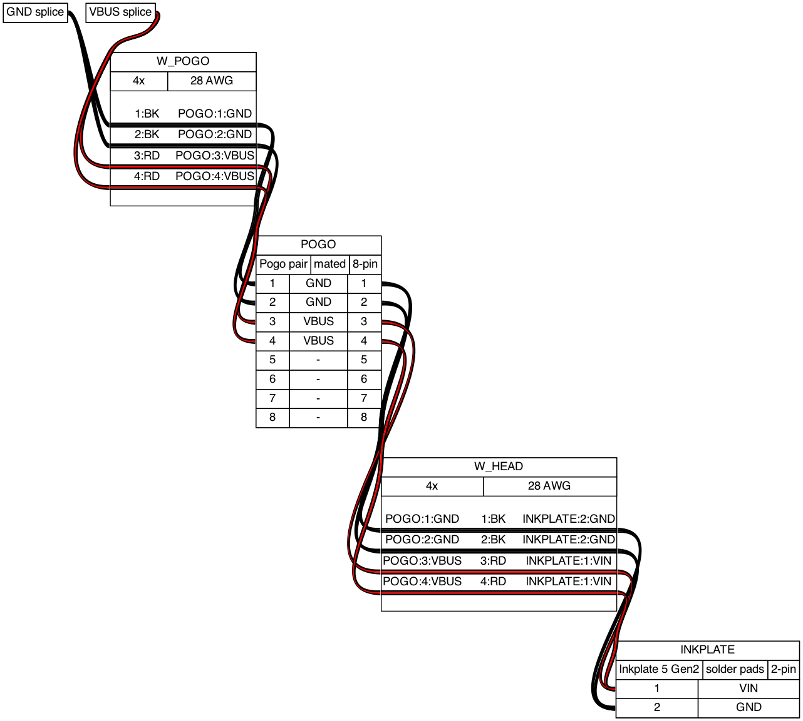

1. Solder both halves on the bench, before either goes into its shell. GND goes on the two contacts nearest the
   head's USB-C end, VBUS on the other two.
2. Lay each stripped wire end across its pair of tails, and solder the bridge across the pair in one go.
3. **Fit the Inkplate before the male half.** The male's back band sits at the board's bottom edge, and with the
   connector in place the board cannot pass it.
4. Glue the male's lip to the head's cavity floor, between the two locating ribs.
5. Drop the female into the dock's plinth, its lip on the ledge, and glue it.

The halves nest, and the contact block's outline keys them, so a head turned end for end will not close.

## 8. Wire the dock

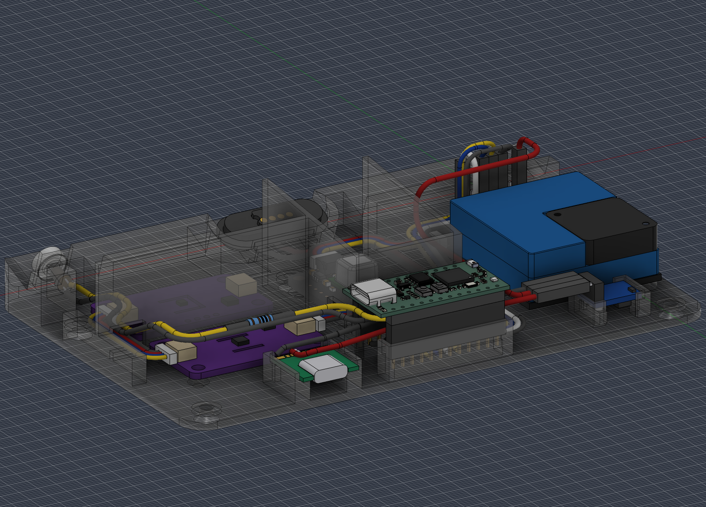

*This is what the dock looks like when the step is done.*

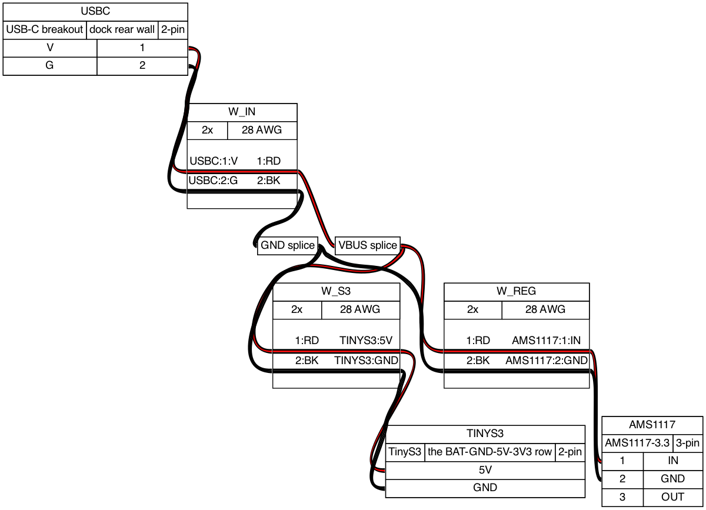

Power comes in at the USB-C socket as 5 V and splits three ways: to the TinyS3, to the AMS1117 that makes the
sensors' 3.3 V, and up two pogo contacts to the head. Each pad, leg and crimp takes one wire only, so each net
is gathered at **one splice** in the middle of the TinyS3's channel — twisted end to end, soldered, heat-shrunk —
and the branches leave from both ends of it.

The channel is the dock's duct. Every wire that crosses behind the sensors runs through it, stacked in layers so
that nothing crosses anything else, and wires that travel together are bundled so their bends stay concentric.

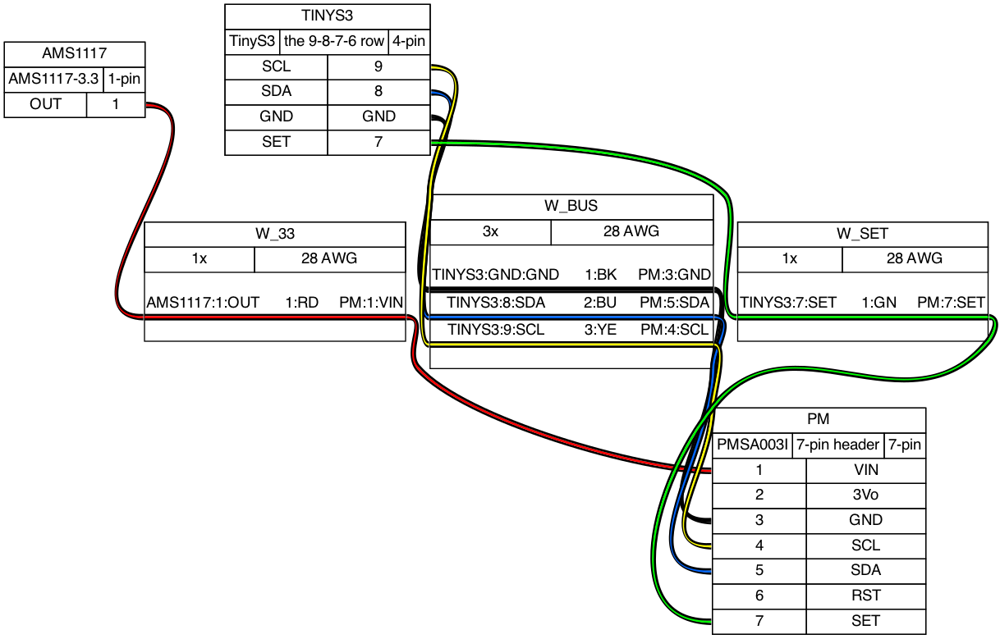

1. **Make the two splices** in the middle of the channel, and bring the USB-C socket's two stubs into the channel
   to reach them.
2. **From the VBUS splice**, run wires to the TinyS3's 5V leg, the AMS1117's VIN and the pogo pair. **From the GND
   splice**, run wires to the TinyS3's GND leg, the AMS1117's GND, the LED and the pogo pair.
3. **The pogo pair.** Each wire meets its tail end-on from below, in the chamber under the plinth, and leaves into
   the trench. There the two become one bundle: left along the trench, up between the PM board and the SCD41
   compartment, and along the channel to the splices.
4. **The AMS1117.** Its silkscreen reads **GND, OUT, VIN** along the header. The middle pin is OUT on every one
   of these modules, so use it to tell the two ends apart, and check each end before you push a wire on. **5 V on
   the GND pin destroys the part.** Its VIN and GND wires run straight along the channel into their housings, the
   shortest wires in the dock. **AMS OUT → PM VIN** leaves the middle housing, crosses the module under the skin,
   and drops into the PM header's VIN housing.
5. **The PM group.** The three conductors of cable 1, and SET, leave their legs, become one bundle along the
   channel, and run up and along the front of the bay.
6. **Enter every housing from the top, coming over the row from behind.** The head's back cover leans over the
   header from the front, so no wire can turn into a housing from that side. SET's housing is last in the row, so
   its wire hairpins over it — the tightest bends in the dock.
7. **The LED pair.** Back over the SHTC3, up the right-hand ribbon lane, past the BME688 and across the bay. At
   the far side they part: the signal into the channel and onto the TinyS3's leg, the ground onto the GND splice.

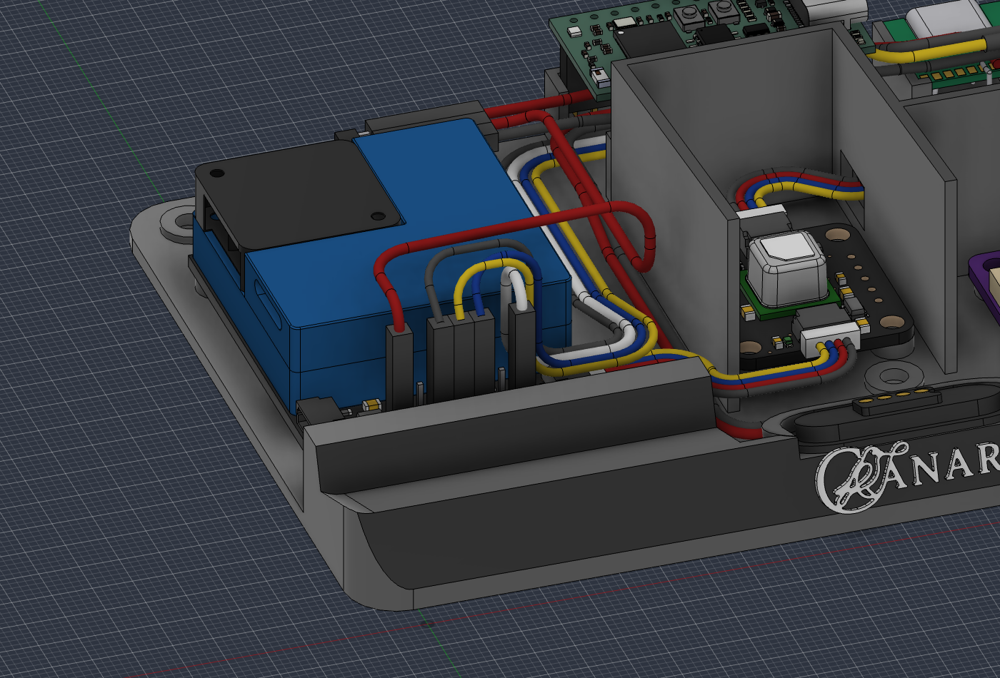

**Cable 1 is a Qwiic cable used for its conductors.** Cut both plugs off, solder GND, SDA and SCL to their TinyS3
legs at one end, and crimp them into Dupont housings at the other. **Cut the 3V3 conductor back and insulate both
ends** — connected, it would feed the chain from the TinyS3's regulator as well as the AMS1117. On a standard
cable 3V3 is the red wire; find it in a plug before you cut the plugs off.

[Appendix: every joint](#appendix-every-joint) lists all seventeen in one table, to tick off as you go.

## 9. The head

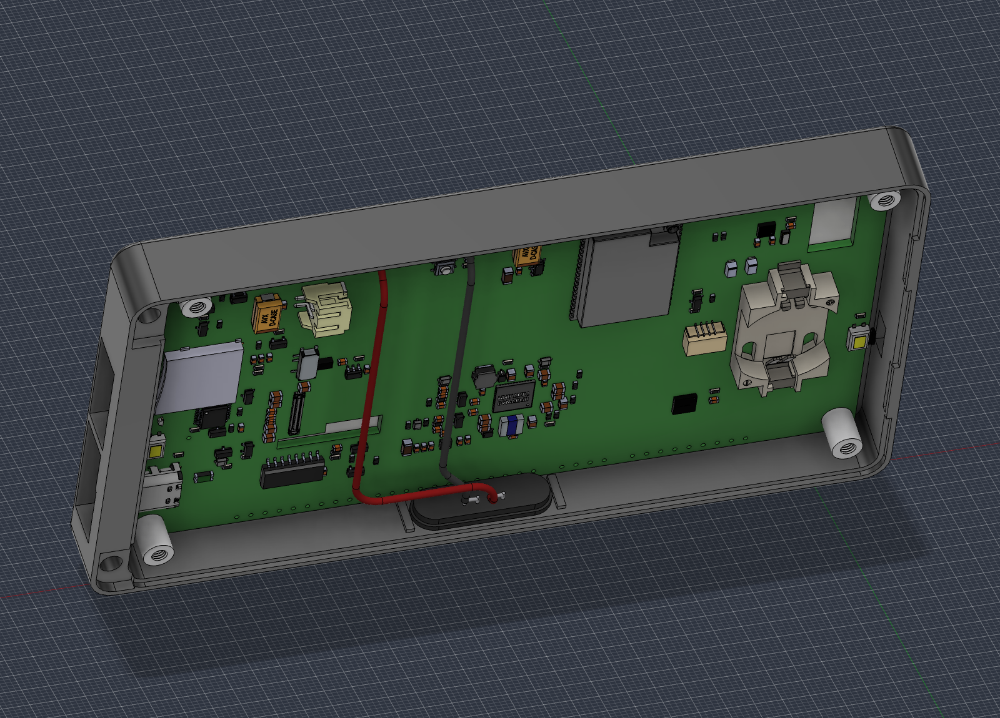

Two wires and nothing else. 5 V on the Inkplate's VIN pads is Soldered's own answer for this circuit
([forum thread 1934](https://community.soldered.com/t/externally-powering-the-inkplate-5v2-with-5v/1934)), and
the board's own USB-C sits behind the dock's side wall while the head is docked.

1. Solder VBUS to PAD3 (VIN) and GND to PAD5, the 4 × 4 mm pads on the top edge above the reset button. Both are
   on the component side, which faces the cover.
2. Run each wire down the board in its own column, behind it: the ground's between the bulk capacitor and the
   reset button, the other clear of everything.
3. Take both along the bottom edge to the pogo male's tails. Use the **tail row nearer the cover** and leave the
   other row empty. GND reaches the outermost tail in line; VBUS runs under the two GND tails and rises onto its
   own.
4. Put the Inkplate in from the back, enter the cover's two tongues into the slots in the thin wall, and swing
   the cover down onto the board's four standoffs.
5. Drive four M3 × 6 into the standoffs, and two more through the cover's ears into the tray's inserts.

## 10. Close the dock

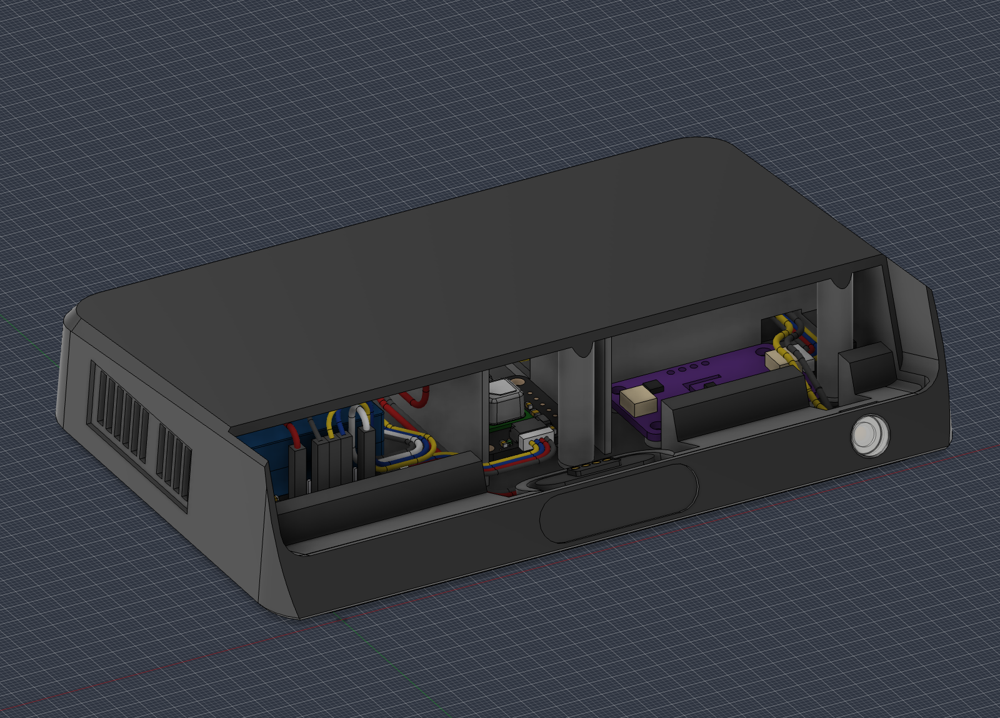

1. Lay every wire down into its lane, so nothing stands above the skin's underside.
2. Drop the shell on.
3. Drive four M3 × 8 countersunk screws up from underneath into the inserts.

**A screw that meets no thread means the shell is not seated.** Lift it and look for a wire over a pillar.

## 11. The logo

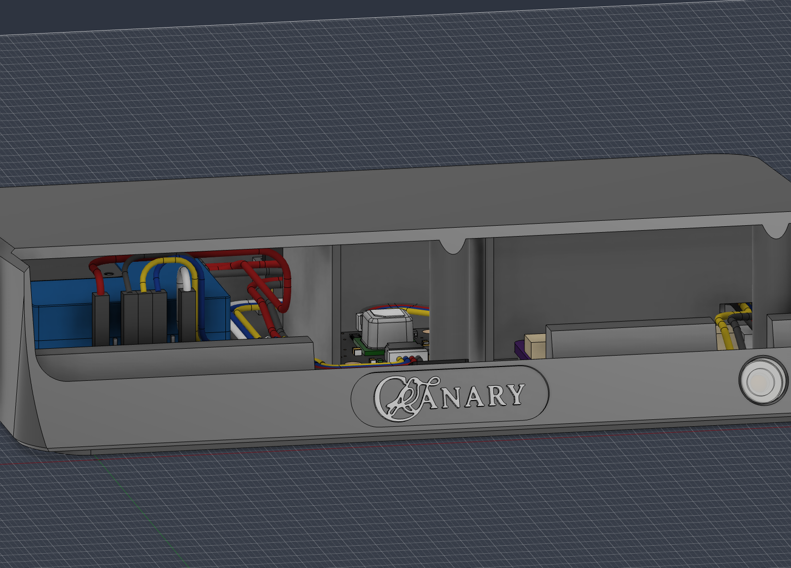
White letters, 0.8 mm thick and 8 mm tall, in the pill recess in the shell's front face. They are separate
pieces, and the stencil holds each one in place while the glue takes.

1. Set the stencil into the recess, its handles resting on the face at each end.
2. Put a little glue on the back of each piece, and drop it through its own opening.
3. Press each piece flush with the face.
4. Lift the stencil straight out before the glue sets.

## 12. First power-up

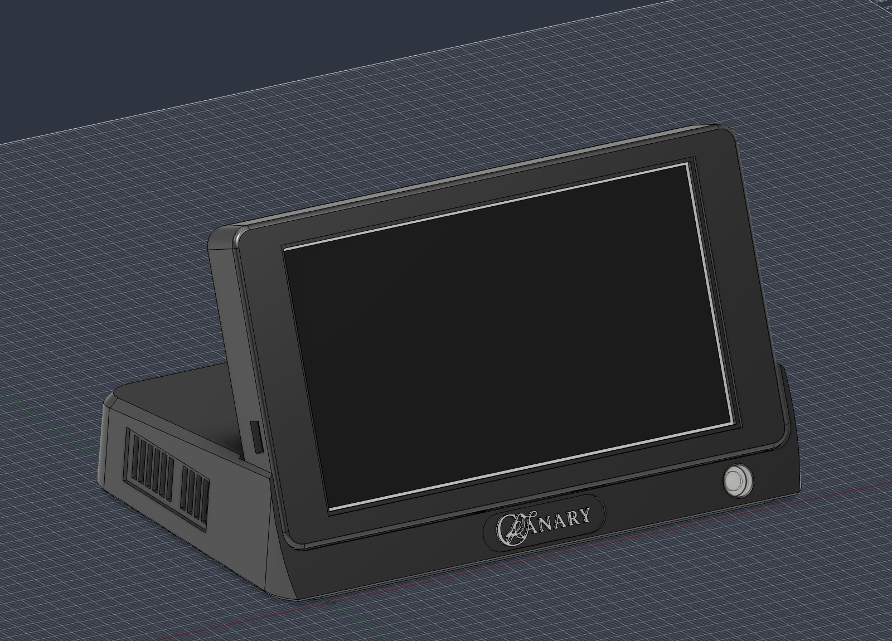
Each board stores your WiFi and the server's address from `src/defaults.cpp`. Everything after that — every
image, and every later firmware — comes from the server.

1. Write your own `src/defaults.cpp`.
2. Flash the head and the dock over USB. [CONTRIBUTING.md](../CONTRIBUTING.md) has the commands and the bench
   checks.
3. Plug one USB-C cable into the dock. It powers both halves.

The LED then tells you where it is. By default: a fast pulse while it connects and starts the sensors, a slow one
when it is reading and posting, and a flash when something is wrong: every second with no Wi-Fi, every 2 s when a
post fails, every 3 s when a sensor is missing. The server's Dock tab sets these looks.

## Appendix: every joint

| # | From | To | Wire |
|---|---|---|---|
| 1 | USB-C socket **V pad** | VBUS splice | 28 AWG, soldered |
| 2 | USB-C socket **G pad** | GND splice | 28 AWG, soldered |
| 3 | VBUS splice | TinyS3 **5V** | 28 AWG, soldered to the leg |
| 4 | GND splice | TinyS3 **GND**, the 5V row | 28 AWG, soldered to the leg |
| 5 | VBUS splice | AMS1117 **VIN** | 28 AWG, Dupont at the AMS1117. Read the silkscreen: **GND, OUT, VIN** |
| 6 | GND splice | AMS1117 **GND** | 28 AWG, Dupont at the AMS1117. The opposite end from VIN |
| 7 | VBUS splice | pogo female, two contacts | 28 AWG, soldered; a bare bridge joins the pair |
| 8 | GND splice | pogo female, two contacts | 28 AWG, soldered; a bare bridge joins the pair |
| 9 | AMS1117 **OUT** | PMSA003I header **VIN** | 28 AWG, Dupont both ends |
| 10 | TinyS3 **9, 8** and the **GND** on that row | PMSA003I header **SCL, SDA, GND** | cable 1, **3V3 conductor removed** |
| 11 | TinyS3 **7** | PMSA003I header **SET** | 28 AWG, Dupont at the header |
| 12 | TinyS3 **6** | status LED, through a 1 kΩ resistor | 28 AWG, the resistor spliced in |
| 13 | GND splice | status LED, other leg | 28 AWG |
| 14 | PMSA003I **easyC socket B** | SCD41 either socket | cable 2: stock Qwiic |
| 15 | SCD41 other socket | BME688 either socket | cable 3: stock Qwiic |
| 16 | BME688 other socket | SHTC3 either socket | cable 4: stock Qwiic |
| 17 | pogo male, two contacts each net | Inkplate **VIN pad** and **GND pad** | 28 AWG, soldered to the 4 × 4 mm pads |

The PM board's 7-pin header is VIN, 3Vo, GND, SCL, SDA, RST, SET. Rows 9, 10 and 11 use **VIN, GND, SCL, SDA and
SET**; 3Vo and RST stay empty.

**The SET wire is optional.** The PM breakout pulls SET high through 100 kΩ
([bom.md](bom.md#pmsa003i--particulates)), so without it the fan runs from power-on and every reading is still
valid. With it, the firmware stops the fan between readings and the 30 s warm-up counts from when it starts.

[bom.md](bom.md#power-and-the-bus) has the current budget, the single ground return and the bus.
